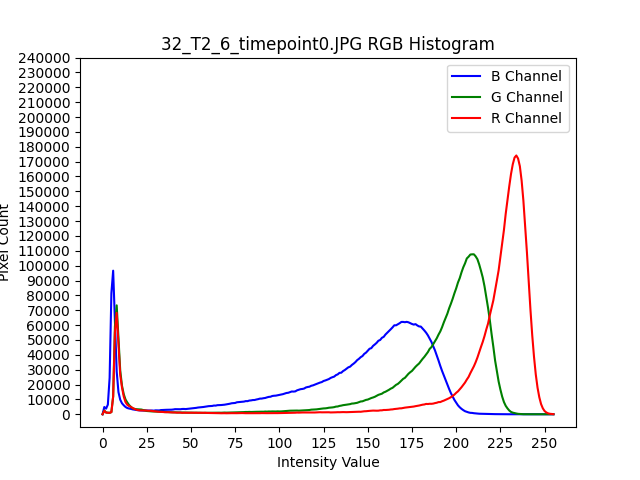

# Initial Observations
## Author(s): Reece Kim
## Created: 12/1/2024
## Last Edited: 12/1/2024

### Purpose

- To find the colonies of the samples as connected
  components to simulate the pixel locations that 
  Prof. Heller's AI is able to find. 

- NOTE: We won't be using the canny colony folders in further experiments.

### Results

 

- An attempt was made to use the canny sample to find the colony map, and attempting 
  to fill in the voids with a photo editor, but that failed as has too many voids, 
  so it detected too many colonies.

 

 

- Instead we decided to mark the colonies manually, the least common color was blue
  so that was used. 

 

- We convert the color rgb(0, 81, 186) to white and all others to black.

 

- Next we will find the connected components to find colonies as components.

