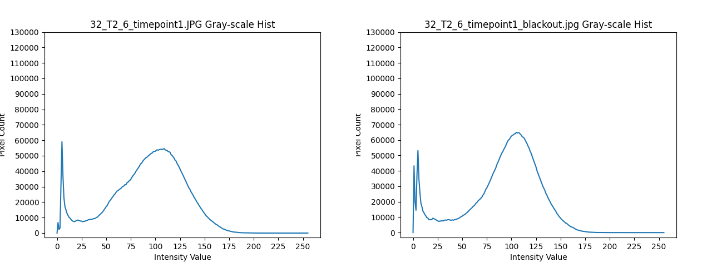
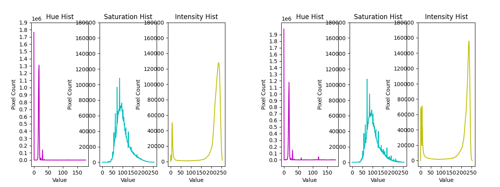

# Observations
## Author(s): Reece Kim
## Created: 11/30/2024
## Last Editied: 11/30/2024

### Purpose

- The purpose of analyzing the gray-scale, rgb, an hsi histograms is to see if there is
  some kind of threshold or value range we could increase the intensity of to make the 
  coral spawn more distinguishable.

### Preprocessing

- The blackout images were made in Google Drawings. They were exported at low resolution after
  adding the black circles, then import and exported again to increase the resolution. 
- When making the histograms, we decreased the size of the base samples from
  3532 x 3532 to 2500 x 2500 to have a fair comparison between the base/control and blackout 
  histograms.  
- In the following histograms the black (0) pixel values were removed for RGB and gray-scale to
  remove the background and blackout pixel from the analysis and make differences in the other values
  more noticeable.  Similar was done with the hsi histograms, but with only saturation and intensity. 

### Results

#### Gray-Scale

**fig. 1**

**fig. 2**

**fig.3**

- In figure 1, circled in blue the lower intensities were increased.
  This is expected as this is likely because of the blackened out spawn.
  They were blackened out and then turned to gray-scale, so perhaps portions 
  of the dots were not of intensity 0, but still a very low one.
- In figure 1 and 2, in red, the dominant color seems to have increased,
  but the curve seems to have thinned. This might be due to compression of the
  blackened out image being imported and exported multiple times.
- In figure 3, the blue circle is actually noise. Due to the way the corresponding
  blackout image was cropped, the edge has a few rows of white pixels.

#### HSI

**fig. 4**

**fig. 5**

- In figure 5, in blue, similar to the grayscale, the lower intensities increased, likely for
  the same reasons.
- In figure 4, in red the dominant saturation increased, but the curve also seems to have thinned
  this is likely due to compression in the blackout samples.
- In green, two hues when from 0 to positive in the blackout samples, but as seen in figure 5, 
  which is the sample with ~180 spawn in it, the two hue increases are likely from the black dots we added, 
  since hue doesn't account for black.  

#### RGB

- Similar result were observed in RGB

### Conclusion

- There seems to be no unique value or value range that can be intensified
  to increase the visibility of the spawn. Time should be allocated elsewhere. 

